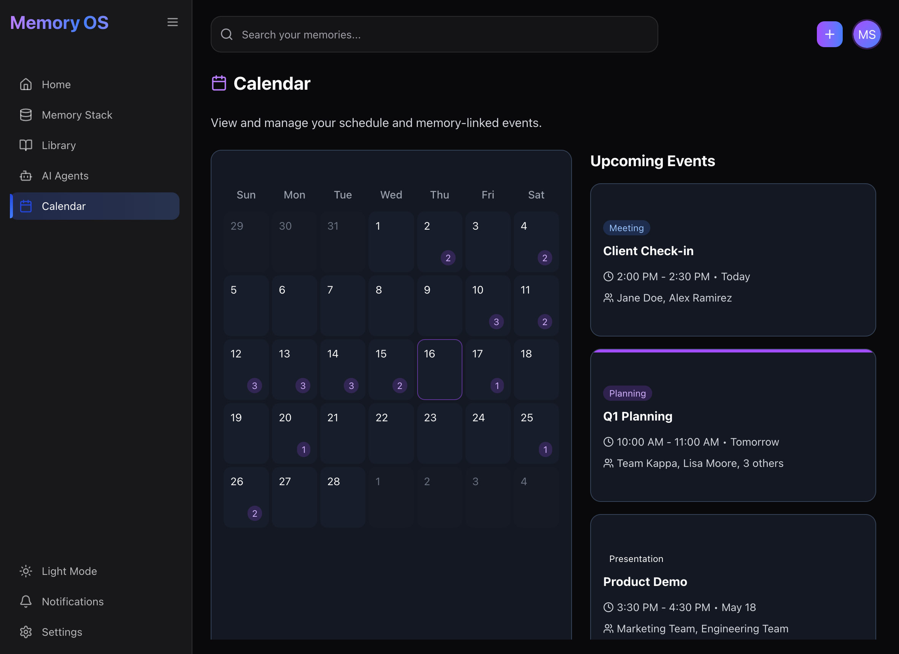
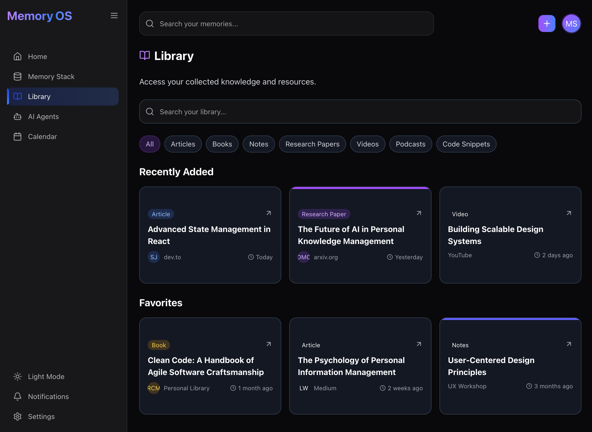

# MemoryOS

> A modern, AI-powered personal knowledge management system built with Next.js 15 and TypeScript


## Overview

MemoryOS is a personal knowledge management application that helps users capture, organize, and retrieve their thoughts, notes, and insights with ease. Built with a focus on user experience and visual appeal, it features a dark, gradient-rich interface reminiscent of cutting-edge productivity tools.

### Key Features

- **Smart Memory Cards**: Dynamic content display with rich text and list support
- **AI-Powered Assistant**: Natural language queries to find and organize memories
- **Structured Collections**: Six organized memory stacks (Research, Product, Meeting, Learning, Idea, Task)
- **Calendar Integration**: Memory-linked events and intelligent meeting management
- **Knowledge Library**: Categorized resource management (Articles, Books, Papers, Videos, Podcasts, Code)
- **Smart Notifications**: Contextual alerts and meeting reminders
- **Modern Dark UI**: Beautiful gradient-rich interface with smooth animations
- **Responsive Design**: Seamless experience across desktop and mobile devices
- **Real-time Updates**: Dynamic content updates and live memory synchronization

## Screenshots

### Dashboard - Your Memory Hub

*Clean, modern dashboard featuring recent memory notes and upcoming meetings with an integrated AI assistant*

### Memory Stack - Organized Collections

*Six categorized memory collections (Research, Product, Meeting, Learning, Idea, Task) with color-coded organization*

### AI Assistant - Intelligent Memory Companion

*Built-in MemoryOS Assistant for natural language queries about your stored memories and information*

### Calendar - Schedule & Memory Integration

*Interactive calendar view with memory-linked events, upcoming meetings, and smart scheduling*

### Library - Knowledge Repository

*Comprehensive library with categorized resources: Articles, Books, Research Papers, Videos, and more*

## Tech Stack

- **Framework**: [Next.js 15](https://nextjs.org/) with App Router
- **Language**: [TypeScript](https://www.typescriptlang.org/) for type safety
- **Styling**: [Tailwind CSS](https://tailwindcss.com/) for utility-first styling
- **UI Components**: [shadcn/ui](https://ui.shadcn.com/) for consistent, accessible components
- **Icons**: [Lucide React](https://lucide.dev/) for beautiful, customizable icons
- **State Management**: React hooks for local state management

## 🛠️ Installation & Setup

### Prerequisites

- Node.js 18+ 
- npm, yarn, or pnpm

### Quick Start

1. **Clone the repository**
   ```bash
   git clone https://github.com/yourusername/memoryos.git
   cd memoryos
   ```

2. **Install dependencies**
   ```bash
   npm install
   # or
   yarn install
   # or
   pnpm install
   ```

3. **Set up shadcn/ui**
   ```bash
   npx shadcn-ui@latest init
   npx shadcn-ui@latest add card input avatar scroll-area
   ```

4. **Run the development server**
   ```bash
   npm run dev
   # or
   yarn dev
   # or
   pnpm dev
   ```

5. **Open your browser**
   Navigate to [http://localhost:3000](http://localhost:3000)

## ## Project Structure

```
memoryos-ui/
├── src/
│   ├── app/                    # Next.js App Router pages
│   │   ├── page.tsx           # Dashboard with memory cards & meetings
│   │   ├── memory-stack/      # Six categorized memory collections  
│   │   ├── ai-agents/         # AI Assistant chat interface
│   │   ├── library/           # Knowledge library with filtering
│   │   ├── calendar/          # Interactive calendar with events
│   │   ├── notifications/     # Alert and notification center
│   │   ├── profile/           # User settings and preferences
│   │   └── new-memory/        # Memory creation and editing
│   ├── components/
│   │   ├── layout.tsx         # Shared layout with sidebar navigation
│   │   └── ui/                # shadcn/ui component library
│   └── styles/               # Global styles and theme configuration
├── public/                    # Static assets and screenshots
├── tailwind.config.js         # Tailwind CSS configuration
├── next.config.js            # Next.js build configuration
└── package.json              # Dependencies and scripts
```

## Design Philosophy

MemoryOS follows modern design principles with a focus on:

- **Dark Theme**: Reduces eye strain during extended use
- **Gradient Accents**: Purple-to-blue gradients for visual hierarchy
- **Glassmorphism**: Subtle transparency effects for depth
- **Smooth Animations**: Enhances user experience without being distracting
- **Responsive Design**: Works seamlessly across desktop and mobile devices

### Color Palette

```css
Primary: Purple (#8B5CF6) to Blue (#3B82F6)
Background: Slate 950 (#020617) to Slate 900 (#0F172A)
Cards: Slate 800/50 with transparency
Text: White (#FFFFFF) and Gray variants
Accents: Emerald, Amber, Pink, Indigo variants
```

## Key Components & Architecture

### Dashboard Layout
- **Memory Cards Grid**: Responsive 2-column layout with gradient backgrounds
- **Meeting Sidebar**: Real-time upcoming events with participant avatars
- **AI Assistant Widget**: Contextual memory queries and suggestions
- **Quick Actions**: Instant memory creation and search access

### Memory Stack System
Six distinct categories with unique color schemes:
```
Research    - Blue gradient
Product     - Purple gradient  
Meeting     - Orange gradient
Learning    - Green gradient
Idea        - Cyan gradient
Task        - Purple gradient
```

### AI Assistant Features
- **Natural Language Processing**: Ask questions about your memories
- **Contextual Responses**: Intelligent memory retrieval and organization
- **Chat Interface**: Clean, WhatsApp-style conversation UI
- **Memory Linking**: Automatic connections between related content

### Library Organization
Advanced filtering system with 7 content types:
- **Articles** - Web content and blog posts
- **Books** - Reading materials and references  
- **Notes** - Personal annotations and thoughts
- **Research Papers** - Academic and technical documents
- **Videos** - Educational and reference videos
- **Podcasts** - Audio content and discussions
- **Code Snippets** - Development resources and examples

## Features Deep Dive

### Dynamic Dashboard
- **Smart Memory Grid**: 2x3 responsive layout with gradient-themed cards
- **Real-time Meeting Sidebar**: Upcoming events with participant management
- **Memory Assistant Integration**: Quick access to AI-powered memory queries
- **Live Content Updates**: Dynamic memory card content with edit capabilities

### Memory Stack Organization  
Six intelligent categories for structured knowledge management:
- **Research** - Studies, analysis, and insights
- **Product** - Development ideas and roadmaps  
- **Meeting** - Notes, action items, and follow-ups
- **Learning** - Educational content and skill development
- **Idea** - Creative concepts and brainstorming
- **Task** - To-dos, deadlines, and project management

### AI Assistant Capabilities
- **Conversational Interface**: Natural language memory queries
- **Contextual Understanding**: Smart retrieval based on content relationships
- **Memory Suggestions**: Proactive recommendations for organization
- **Quick Search**: Instant memory location and content preview

### Library Management System
Advanced content organization with:
- **Multi-format Support**: Articles, Books, Papers, Videos, Podcasts, Code
- **Smart Categorization**: Automatic tagging and classification
- **Favorites System**: Personal curation and quick access
- **Source Attribution**: Author, platform, and date tracking

### Calendar & Event Integration
- **Memory-linked Events**: Connect meetings to relevant memory content
- **Visual Event Tracking**: Color-coded categories and time management
- **Participant Management**: Avatar display and team coordination
- **Smart Scheduling**: AI-suggested optimal meeting times

## Configuration

### Environment Variables

Create a `.env.local` file in your root directory:

```env
# Database (if using external database)
DATABASE_URL="your-database-url"

# Authentication (if implementing auth)
NEXTAUTH_SECRET="your-secret-key"
NEXTAUTH_URL="http://localhost:3000"

# AI/Search Integration (future enhancement)
OPENAI_API_KEY="your-openai-key"
```

### Customization

#### Themes
Modify `tailwind.config.js` to customize colors:

```javascript
module.exports = {
  theme: {
    extend: {
      colors: {
        // Your custom color palette
      }
    }
  }
}
```

#### Components
All UI components are customizable through the `src/components/ui/` directory.


### Code Style

- Use TypeScript for all new code
- Follow the existing code style and formatting
- Add proper type definitions
- Include JSDoc comments for complex functions

## Roadmap

### Version 2.0
- [ ] User authentication and multi-user support
- [ ] Real-time collaboration features
- [ ] Advanced AI integration for smart suggestions
- [ ] Mobile app (React Native)
- [ ] Offline sync capabilities

### Version 1.5
- [ ] Export/import functionality
- [ ] Advanced search filters
- [ ] Memory templates
- [ ] Integration with external tools (Notion, Obsidian)
- [ ] Dark/light theme toggle

### Version 1.1
- [ ] Backend integration (database persistence)
- [ ] User preferences storage
- [ ] Advanced memory categorization
- [ ] Bulk operations

